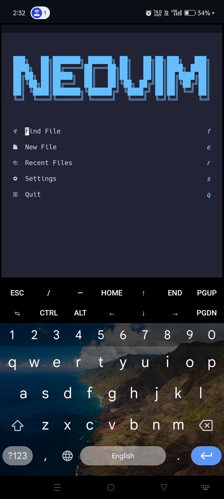

# My Neovim Configuration

### About This Configuration

This is my first Neovim configuration, built specifically for smartphone use via Termux. It's designed for educational purposes — both for my personal learning and for anyone else interested in creating a full-fledged mobile IDE using Neovim.

While the setup is mostly stable, some issues may still exist due to platform-specific limitations in Termux. I actively maintain and improve this configuration, but I welcome contributions, suggestions, and bug reports from others.

Feel free to open issues, suggest improvements, or help others. I'm still learning Neovim and programming myself, so collaboration is always appreciated.

> [!NOTE]
> ⚡️ A lightweight and powerful Neovim setup focused on productivity.

## Features

- Modern Simple UI (Alpha dashboard).

- LSP and Autocompletion for selected languages (Python, Lua, TypeScript, etc.).

- Formatters and Linters (none-ls aka null-ls).

- Telescope and Fzf integration.

- Neotree for file exploring.

- Treesitter highlighting.

- Mobile friendly Keybindings.

- Debugging support with debug.lua.

- Nerd fonts icons (nvim-webdev-icons & mini-icons).

- Lualine and Bufferline integration.

- Which-key and Noice.nvim support.

## Requirements

- [Termux GitHub](https://github.com/termux/termux-app)

- [Termux Fdroid](https://f-droid.org/packages/com.termux)

- Neovim 0.11.0 (Strongly recommend)

- Nerd Fonts (Download Termux Styling from F-Droid or GitHub and use any Nerd font).

- Git (For cloning and Managing repository).

## Now Some Serious Requirements ❗

> [!CAUTION]
> Before setting up anything, you should check these things in your Termux first:

### Language and Plugin Dependencies

### Lua Setup (Recommend)

- Lua 5.1+ (interpreter needed for Lua plugins and configs).

- Luarocks (package manager for Lua modules).

- luacheck (for Lua code linting and static analysis).

- Lua Language Server (for LSP support; recommend installing the smartphone-supported version from GitHub).

> [!NOTE]
> Stylua does not work by default in Termux because official binaries are not available for ARM64 or ARMv7 Android devices. If you'd like to use Stylua, you'll need to:
>
> 1. Find or clone the Stylua source code from its GitHub repository.
> 2. Install Rust using `pkg install rust` or `rustup`.
> 3. Build Stylua manually using `cargo build --release`.
>
> This process depends on your phone's architecture (ARM64-v8a or ARMv7). Once built successfully, you can integrate Stylua into your Neovim setup.

### Python Setup

- Python (required for Python development and Neovim Python integration).

- pynvim (Python client for Neovim; install via `pip install pynvim`).

- debugpy (for Python debugging support).

- flake8 (Python linter).

- black (Python code formatter).

- prettier ( you can leave this because Mason will install it automatically).

- pyright (It will be also installed automatically via Mason

> [!NOTE]
> Ruff does not work out of the box in Termux because it requires native Rust compilation, which can be complex on Android. If you still want to use Ruff, you'll need to install Rust via rustup, build Ruff from source, and ensure all dependencies are correctly configured. If successful, you can replace Flake8 and Black with Ruff for faster and unified linting.

### Node.js Setup

- Node.js 20+ (required for some plugins and LSPs).

- npm (Node.js package manager).

- yarn (A better Node.js package manager for faster installation and better management).

- Neovim Node.js Client (`npm install -g neovim`) (enables Node-based plugins).

### Build Tools

- Ninja (for building LSP servers like Lua-language-server).

- CMake (recommended for building certain LSP tools or native extensions).

### Recommended Tools

- ripgrep (for fast file searching, improves Telescope performance).

- fd (simple, fast alternative to find command; enhances Telescope performance).

### Special Notes for Termux Users (Smartphone)

> Since this setup is optimized for smartphones (especially using Termux), make sure:

- Termux is updated to the latest version.

- You have a proper package source (F-Droid or official GitHub release).

- Compiling large servers like Lua-Language-Server might take time; clone smartphone-supported versions where available.

- Consider using lightweight alternatives where possible to avoid device overheating and battery drainage.

## Installation Commands (Short Summary)

### Basic packages

`pkg install git neovim nodejs python lua luarocks cmake ninja`

### Python packages

`pip install pynvim debugpy flake8 black`

### Node.js Neovim client

`npm install -g neovim`

### Lua checker

`luarocks install luacheck`

### Recommended additional tools

`pkg install ripgrep fd`

## Contribution 🫡

- Feel free to open an issue or create a pull request!💯

## License

This configuration is released under the MIT License. You are free to use, modify, and distribute it as you like, with proper attribution.

> [!NOTE]
> This setup relies on several third-party plugins and tools. Each plugin retains its own license and should be respected accordingly. Please refer to the plugin repositories for more information.

## Credits

### [Kickstart.nvim](https://github.com/nvim-lua/kickstart.nvim) - for initial structure inspiration and best practices.

### Henry Misc – whose Neovim tutorials significantly guided the setup and workflow decisions.Watch the channel here: [Henry Misc on YouTube](https://youtu.be/KYDG3AHgYEs?si=6GgJ39KnuQJG7swc)
